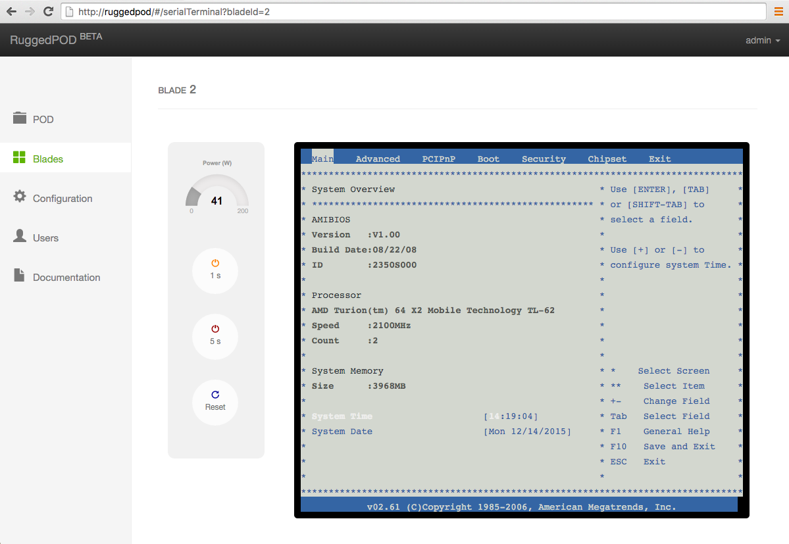

# RuggedPOD Web Console

This is a management console built on top of the [RuggedPOD API](https://github.com/RuggedPOD/ruggedpod-api).

## Overview

The console allows you to control the 4 blades presents in the RuggedPOD.

[](doc/screenshot.png)

An emulated VT100 terminal allows you to connect to the serial port of each
blade.

[](doc/screenshot-serial-console.png)

## Contribute

The easyest way to setup your development is to use [Vagrant](https://www.vagrantup.com/). It will automatically create a virtual machine provision it with everything that is needed to run the
RuggedPOD web console :

* An apache server with the mod_proxy enbaled
* Python and system dependencies required by the RuggedPOD API
* The RuggedPOD API running in "mock" mode

First, install [Vagrant](https://www.vagrantup.com/downloads.html) and
[Virtualbox](https://www.virtualbox.org/wiki/Downloads) on your system. Then, you need to have
the `ruggedpod-api` repository alongside the `ruggedpod-web` repository.

```
 |
 |-- ruggedpod-api
 |-- ruggedpod-web
```

Finally, go in the `ruggedpod-web` directory and run

```
$ vagrant up
```

A few minutes later your virtual machine will be up and running with all the needed material.

The web console should be available on [http://localhost:8000](http://localhost:8000).
